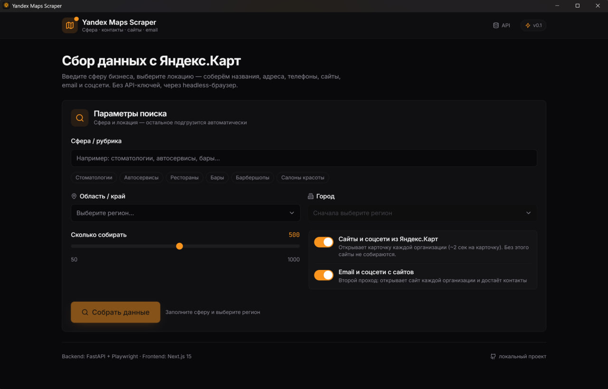

<div align="center">

# 🗺️ Yandex Maps Scraper

**Desktop-приложение для сбора данных с Яндекс.Карт**

Сфера бизнеса · контакты · сайты · email · соцсети

[](https://github.com/bmxer32/yandex-maps-scraper/releases)
[](LICENSE)
[](https://github.com/bmxer32/yandex-maps-scraper/releases)

</div>

---



## 📋 Возможности

- 🔍 **Поиск по сферам бизнеса** — стоматологии, автосервисы, рестораны, бары и любые другие ниши
- 📍 **Географический каскад** — страна → область → город → район / метро (Москва и Санкт-Петербург с полным списком районов и станций метро)
- 📞 **Полные контакты** — название, адрес, телефон, координаты, часы работы, рейтинг, отзывы, рубрики
- 🌐 **Сайты и соцсети** — автоматическое извлечение из карточек организаций (VK, Telegram, WhatsApp, YouTube, Instagram, Facebook и др.)
- 📧 **Email с сайтов** — второй проход по сайтам организаций для сбора email-адресов
- 📊 **Удобный интерфейс** — фильтры (с сайтом / без сайта), сортировка, поиск по таблице
- 📈 **Прогресс в реальном времени** — отслеживание этапов парсинга через Server-Sent Events
- 💾 **Экспорт** — выгрузка результатов в Excel (.xlsx) или CSV, с опцией «только организации с сайтом»
- 🎭 **Антидетект** — stealth-маскировка браузера, рандомизация User-Agent, «человеческие» задержки, поддержка прокси
- 🎯 **Точечный поиск** — найти конкретную компанию по названию, адресу, телефону или ссылке на Яндекс.Карты
- 🧠 **Отбор клиентов** — две оси разом: кому продать ИИ-ассистента и кому сделать или переделать сайт
- 🤖 **Персональные демо** — собрать сайт клиента в базу знаний и выдать ссылку на ИИ-ассистента в Telegram
- 🕘 **История выгрузок** — собранное сохраняется и открывается после перезапуска без повторного парсинга

## 🚀 Установка

### Готовый установщик (для пользователей)

1. Скачайте `YandexMapsScraper-Setup-0.3.0.exe` из [Releases](https://github.com/bmxer32/yandex-maps-scraper/releases)
2. Запустите установщик — выберите папку установки
3. Запустите «Yandex Maps Scraper» с рабочего стола или из меню Пуск
4. Введите сферу бизнеса, выберите город — нажмите «Собрать данные»

> ⚠️ При первом запуске Windows SmartScreen может показать предупреждение (приложение без цифровой подписи). Нажмите «Подробнее» → «Выполнить в любом случае».

### Сборка из исходников (для разработчиков)

```powershell
git clone https://github.com/bmxer32/yandex-maps-scraper.git
cd yandex-maps-scraper

# Backend (Python 3.11+)
cd backend
python -m venv .venv
.\.venv\Scripts\Activate.ps1
pip install -r requirements.txt
playwright install chromium

# Frontend (Node.js 20+)
cd ..\frontend
npm install
npm run build        # генерирует статический экспорт

# Desktop (Electron)
cd ..\desktop
npm install
npm run dist         # собирает установщик .exe в release/
```

Перед `npm run dist` нужно собрать бэкенд, иначе паковать нечего:

```powershell
cd ..\backend
.\.venv\Scripts\Activate.ps1
pyinstaller yascraper.spec
```

Браузер Playwright кладётся в сборку автоматически: `npm run dist` сначала
запускает `scripts/prepare-browsers.mjs`, который находит свежую версию в
`%LOCALAPPDATA%\ms-playwright` и копирует её туда, где её ждёт `run.py`.
Ни PyInstaller, ни electron-builder браузеры сами не тащат — без этого шага
установщик собирается на вид рабочим, а падает у пользователя на первом же
поиске с «Please run playwright install».

Кладётся только headless-версия (~270 МБ): приложение работает в headless.
Если нужен и полный Chromium (ещё ~420 МБ, для `HEADLESS=false`) — соберите
с `INCLUDE_FULL_CHROMIUM=1`.

## 🛠️ Использование

Интерфейс разбит на три вкладки: **Поиск**, **История** и **Демо**.

### Собрать нишу

1. **Введите сферу** — например «стоматологии», «автосервисы», «бары»
2. **Выберите локацию** — область → город → район / метро (для крупных городов)
3. **Настройте параметры**:
   - Сколько организаций собрать (от 50 до 1000)
   - «Сайты и соцсети из Яндекс.Карт» — открывает карточки организаций (медленнее, но даёт сайты)
   - «Email и соцсети с сайтов» — второй проход по сайтам организаций
4. **Нажмите «Собрать данные»** — следите за прогрессом в реальном времени
5. **Фильтруйте и экспортируйте** — кнопки Excel / CSV в правом верхнем углу таблицы

Рядом с названием каждой организации — булавка, открывает её карточку в Яндекс.Картах.

Если у компании несколько телефонов или сайтов — в таблице **все**, с городом при каждом номере («Москва», «Сочи») и в порядке карточки: первый главный. В Excel для этого есть отдельные колонки «Все телефоны» и «Все сайты».

### Найти конкретную компанию

Переключатель **«Найти компанию»** в форме поиска — одно поле, принимает:

| Что вводите | Что находит |
|---|---|
| `yandex.ru/maps/org/108811824146/` | ровно эту организацию |
| `+7 923 244-61-42` | ровно эту компанию — телефон уникален |
| `Альбера Новосибирск` | компании с таким названием в городе |
| `Новосибирск Орджоникидзе 30` | организации по адресу |

Город лучше указывать: без него найдётся однофамилец из другого региона.

### Отобрать перспективных

Кнопка **«Оценить»** прогоняет видимые строки через три ступени, от дешёвой к дорогой:

1. **Механика** — что лежит в поле «сайт» (свой сайт, страница ВКонтакте, виджет записи), дубли карточек, порог по отзывам. Мгновенно, без сети.
2. **Проба главной** — отвечает ли сайт, не закрыт ли антиботом, свежий ли копирайт, нет ли упоминания филиалов. По одному запросу на каждый сайт компании: если сайтов два, живой современный среди них снимает вопрос о разработке.
3. **Вердикт модели** — сеть или одиночка, живой или заброшен, есть ли что продавать. Смотрит **все** компании: без этого федеральная франшиза с виджетом записи вместо сайта проходила по одному числу отзывов как перспективная.

Оценка идёт **по двум независимым осям**, и модель отвечает по обеим за один вызов:

| Колонка | О чём | «Годится» значит |
|---|---|---|
| **Ассистент** | продать ИИ-ассистента | живой локальный бизнес, есть с чем работать |
| **Сайт** | сделать или переделать сайт | сайта нет вовсе, он лежит, или стек десятилетней давности |

Переключатель над таблицей выбирает активную ось — фильтры и счётчики считаются по ней. Признаки для оси «Сайт» достаются из той же страницы, что уже скачана на второй ступени: нет мобильной вёрстки, `.php` в ссылках, вёрстка таблицами, jQuery ниже 3.x, работа без HTTPS, CMS из `<meta generator>`.

Сеть и франшиза закрывают **обе** оси: там ничего не заказывают на месте.

Отдельно проверяется **онлайн-запись**. Записью считается виджет платформы (YCLIENTS, DIKIDI, EasyWeek), где клиент сам выбирает мастера и время, — а не кнопка со словом «Записаться», которая часто ведёт в телеграм или к форме заявки. Свежий сайт без записи — это «возможно», а не «не нужен»: сайт есть, но клиент всё равно пишет администратору и ждёт ответа, и как раз тут ассистент и нужен. Правило применяется только там, где записываются на время (салоны, клиники, автосервисы, студии); магазину отсутствие записи в минус не ставится.

Конструкторы делятся надвое. Tilda и Wix отдают живой адаптивный сайт — «возможно», менять там особо нечего (и их платформенный jQuery 1.10 не читается как древний стек). uCoz, Nethouse и a5 — платформы нулевых, это прямая цель на замену.

Важно: **строки никогда не скрываются и не удаляются**. Вердикт — это метка и сортировка. Всё неуверенное попадает в «сомнительно», а не в «мимо»: потерять клиента дороже, чем лишний раз взглянуть на строку. Отсеивать имеет право только модель — 403 от антибота или старый копирайт понижают максимум до «сомнительно».

Оси нельзя смешивать: у компании без сайта «Ассистент» может быть «годится», а «Сайт» — лучший из возможных клиентов, при этом демо ей придётся собирать вручную.

Отдельная пометка **«демо вручную»** — у компании нет пригодного для обхода сайта (только ВКонтакте, виджет записи или сайт закрыт). Это **не** плохой клиент: ассистент нужнее всех тому, у кого нет даже сайта, просто базу знаний придётся собрать иначе.

### Сделать демо клиенту

Требует настроенной интеграции с [kb_assistant](https://github.com/bmxer32/kb-assistant) — см. раздел «Настройка» ниже.

1. Отметьте галочками организации с сайтом (или нажмите «Выбрать годных»)
2. **«Сделать демо»** — сайт каждой компании обходится в отдельную базу знаний
3. В колонке «Демо» появится ссылка вида `t.me/бот?start=метка` с кнопкой копирования
4. Отправьте ссылку клиенту — бот будет отвечать по его собственному сайту

Статусы: `Собираю сайт` → `Готово` либо **`Мало данных`** — сайт отдал в основном служебные страницы, такое демо клиенту слать рано. Когда клиент откроет ссылку, в колонке появится «открыл» и число заданных вопросов.

Вкладка **«Демо»** — всё разосланное: кто открыл, сколько спросил, удаление (сносит и собранную базу знаний).

### История

Завершённые выгрузки сохраняются автоматически. На вкладке **«История»** — последние 50: сфера, место, сколько организаций и сколько с сайтом. «Открыть» загружает выгрузку в таблицу целиком, **без повторного парсинга**. Экспорт в Excel из истории тоже работает.

## ⚙️ Настройка

Скопируйте `backend/.env.example` в `backend/.env`. Всё опционально — без ключей работает сбор данных, механический отбор и проба сайтов.

### Демо ИИ-ассистента

```bash
KB_BASE_URL=http://127.0.0.1:8001   # порт 8001: 8000 занят бэкендом парсера
KB_API_KEY=<API_KEY из backend/.env проекта kb_assistant>
KB_BOT_USERNAME=<username Telegram-бота, без @>
```

Стек kb_assistant поднимается автоматически при запуске программы. Путь к проекту по умолчанию `C:\Projects\kb_assistant`, переопределяется переменной `KB_PROJECT_DIR` или файлом `kb-config.json` в папке данных приложения.

### Вердикты модели

Провайдеры пробуются по очереди, пока кто-то не ответит. Ни одного не задано — работают только первые две ступени отбора.

```bash
GOOGLE_API_KEY=          # https://aistudio.google.com/apikey
GOOGLE_API_KEYS_EXTRA=   # запасные ключи через запятую: лимит считается
                         # на проект, ключи с разных аккаунтов складываются
GROQ_API_KEY=            # https://console.groq.com/keys — самый щедрый тир
OPENROUTER_API_KEY=      # https://openrouter.ai/keys — бесплатные модели
```

## 🏗️ Архитектура

Приложение построено на трёх слоях:

```
┌─────────────────────────────────────────────────────────┐
│  Electron (главный процесс)                              │
│  ┌──────────────────────────────────────────────────┐   │
│  │  Python backend (FastAPI + Playwright)            │   │
│  │  ┌─────────────────┐  ┌────────────────────────┐ │   │
│  │  │  Парсер Яндекса │  │  Site-enricher (httpx) │ │   │
│  │  │  (headless      │  │  email + соцсети       │ │   │
│  │  │   Chromium)     │  │                        │ │   │
│  │  └─────────────────┘  └────────────────────────┘ │   │
│  └──────────────────────────────────────────────────┘   │
│  ┌──────────────────────────────────────────────────┐   │
│  │  Next.js static export (UI)                       │   │
│  │  форма поиска · таблица · прогресс · экспорт     │   │
│  └──────────────────────────────────────────────────┘   │
└─────────────────────────────────────────────────────────┘
```

| Слой | Технология | Назначение |
|------|------------|------------|
| **Парсер** | Python · Playwright · httpx | Сбор данных с Яндекс.Карт через headless-браузер |
| **Backend** | FastAPI · SQLAlchemy · SSE | REST API, очередь задач, кэш SQLite, real-time прогресс |
| **Frontend** | Next.js 15 · React 19 · Tailwind | UI: форма, таблица, фильтры, экспорт |
| **Desktop** | Electron · electron-builder | Обёртка в .exe установщик |

## 🔧 Как работает парсинг Яндекс.Карт

Яндекс.Карты рендерят данные организаций server-side прямо в HTML (SSR). Парсер:

1. Открывает `yandex.com/maps/?text=<категория + гео>` в headless Chromium
2. Извлекает JSON-массив организаций из HTML (поиск по структуре `items[].properties`)
3. Скроллит боковую панель для подгрузки следующих страниц
4. Открывает карточки организаций для получения сайтов и соцсетей
5. (Опционально) Обходит сайты организаций для сбора email

**Антидетект:** playwright-stealth, случайные профили браузера (UA, viewport, timezone), «человеческие» задержки, подмена `navigator.webdriver`.

## 📁 Структура проекта

```
yandex-maps-scraper/
├── backend/                   # Python FastAPI + Playwright
│   ├── app/
│   │   ├── core/
│   │   │   ├── scraper/       # Парсер Яндекса + site-enricher
│   │   │   ├── db.py          # SQLite: кэш, история, вердикты
│   │   │   └── geo.py         # Гео-справочник
│   │   ├── api/               # REST роуты + SSE
│   │   ├── models/            # Pydantic-схемы
│   │   └── services/
│   │       ├── search_service.py     # оркестрация парсинга
│   │       ├── history_service.py    # история выгрузок
│   │       ├── prospect_rules.py     # ступень 1: механика отбора
│   │       ├── site_probe.py         # ступень 2: проба главной страницы
│   │       ├── site_verdict.py       # ступень 3: вердикт модели
│   │       ├── prospect_service.py   # сборка ступеней воедино
│   │       └── demo_client.py        # клиент к kb_assistant
│   ├── checks/                # проверки (запускаются вручную)
│   ├── run.py                 # entry point для PyInstaller
│   └── yascraper.spec         # PyInstaller конфиг
├── frontend/                  # Next.js 15 (App Router)
│   ├── app/                   # страницы + layout
│   ├── components/            # SearchForm, ResultsTable, DemosPanel, HistoryPanel
│   └── lib/                   # API клиент, типы, хуки состояния
├── desktop/                   # Electron обёртка
│   ├── electron/
│   │   ├── main.js            # главный процесс
│   │   ├── kb-stack.js        # автозапуск Docker-стека ассистента
│   │   └── preload.js
│   └── package.json           # electron-builder конфиг
└── docs/
    └── screenshots/           # скриншоты для README
```

## 📊 Что собирается

| Поле | Источник | Доступность |
|------|----------|-------------|
| Название | Превью поиска | ~100% |
| Адрес | Превью поиска | ~100% |
| Телефон | Превью поиска | ~90% |
| Координаты | Превью поиска | ~100% |
| Рейтинг / отзывы | Превью поиска | ~80% |
| Сайт | Карточка организации | ~60% |
| Соцсети | Карточка организации | ~50% |
| Email | Сайт организации | ~30% |
| Часы работы | — | не собираются |

Часы работы объявлены в схеме, но Яндекс не отдаёт их в превью выдачи — как и сайт. Сайты добираются вторым проходом по карточкам, часы пока нет.

## ⚠️ Важно знать

- Яндекс защищает карты от автоматического сбора. Приложение использует антидетект, но при больших объёмах (1000+) возможна капча — в этом случае используйте прокси
- Скорость сбора: ~2 сек на организацию с сайтами, ~0.5 сек без сайтов
- Бесплатный тир Gemini считает запросы в минуту и в сутки. Упёрлись в лимит — вердиктов модели не будет, но отбор по механике и пробе сайтов продолжит работать, и **ни одна компания из-за этого не отсеивается**. Помогает добавить второй ключ или Groq
- Программа поднимает Docker-стек ассистента при запуске и **намеренно не гасит его при выходе**: там же живёт Telegram-бот, отвечающий клиентам по разосланным ссылкам
- Приложение предназначено только для личного использования и исследований. Соблюдайте [условия использования Яндекс.Карт](https://yandex.ru/legal/maps_termsofuse/)

## ✅ Проверки

Pytest в проекте не используется — проверки лежат отдельными скриптами и запускаются из папки `backend`:

```bash
python checks/prospects_check.py   # отбор клиентов: 111 проверок
python checks/demos_check.py       # интеграция с kb_assistant: 22 проверки
```

Сеть они не трогают: вызовы модели и пробы сайтов подменяются заглушками.
Отдельный блок в `prospects_check.py` следит за главным правилом — что после
оценки в таблице остаётся столько же строк, сколько пришло, и «мимо» ставится
только при явной причине.

## 📝 Лицензия

MIT License — см. [LICENSE](LICENSE).

---

<div align="center">

Сделано с ❤️ для сбора данных

</div>
